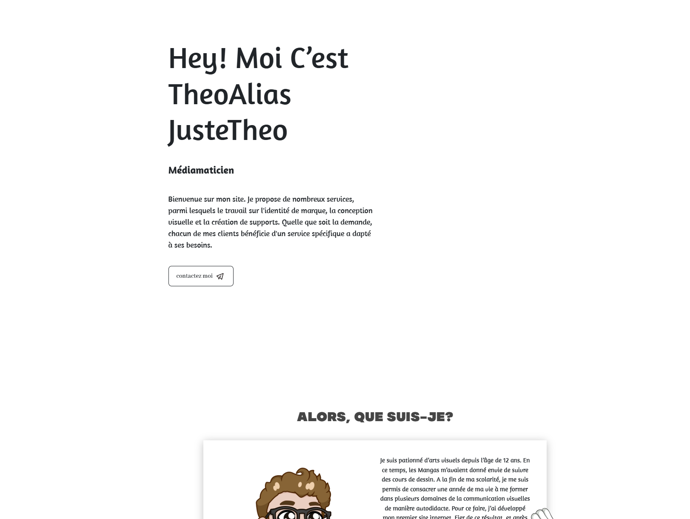

# 🎨 Old Portfolio 2022 – Theo Blondel

Ce dépôt contient le code complet de mon portfolio personnel réalisé en 2022.  
Un projet de transition, entre mes débuts en design et mes explorations plus modernes.

> ⚠️ Ce portfolio n’est plus maintenu.  
> 👉 Découvre ma version actuelle sur [theoblondel.ch](https://theoblondel.ch)

---

## 🖼️ Aperçu




---

## ⚙️ Stack technique

- **HTML5 / CSS3**
- **JavaScript Vanilla**
- Animation CSS & transitions
- Responsive (mobile-first)
- Design inspiré du style minimaliste/suisse

---

## 🛠️ Lancer le projet localement

```bash
git clone https://github.com/theoblondel/portfolio2.git
cd portfolio-2022
# Ouvre index.html dans ton navigateur

